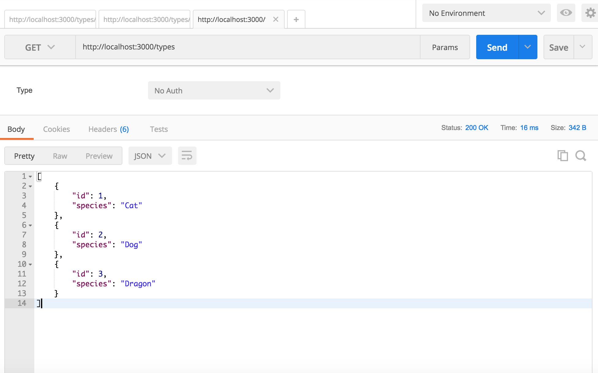
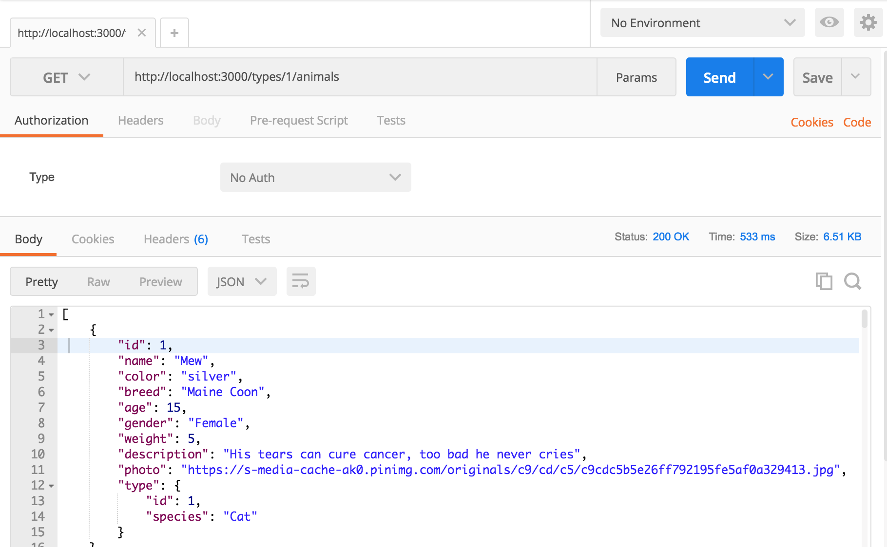
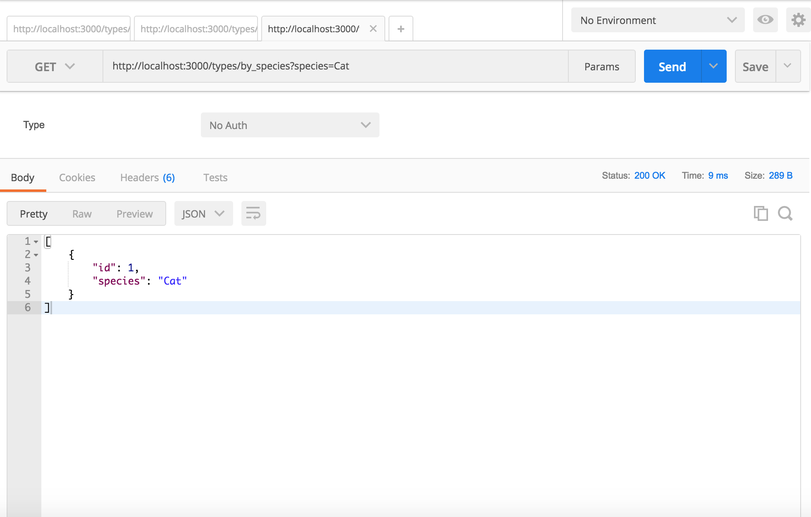
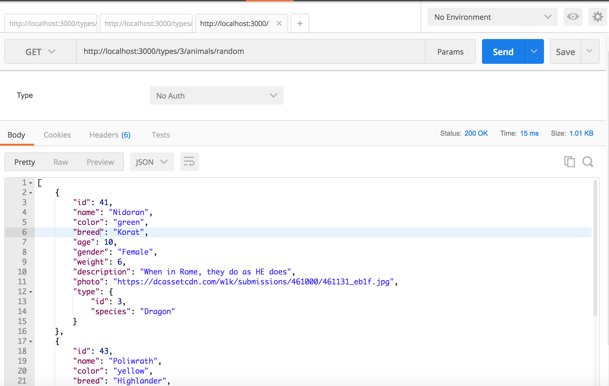

# Animal House

#### _Nicky Santamaria_

## Description

An api that will return a list of animals for different species. It will let you search for type of animal by species.

## Technologies used / Prerequisites

* [Ruby](https://www.ruby-lang.org/en/downloads/)
* [Rails](http://rubyonrails.org/)
* [PostgreSQL](https://www.postgresql.org/docs/9.2/static/app-psql.html)
* [Git](https://git-scm.com/)

## Other Sources

* [Serializer](https://blog.engineyard.com/2015/active-model-serializers)
* [kaminari](https://github.com/kaminari/kaminari)
* [Postman](https://www.getpostman.com/)

## Installation

* `$ git clone https://github.com/nrsantamaria/animal-house`
* `$ cd animal-house`

## PostgreSQL Integration

* `$ postgres`
* `$ rake db:create`
* `$ rake db:migrate db:test:prepare`

## Seed database

* `$ rake db:seed`

## Development server

Run `rails s` for a dev server. Navigate to `http://localhost:3000/`. The app will automatically reload if you change any of the source files. Or checkout [Postman](https://www.getpostman.com/) and see the data a little nicer.

## Specifications

| Behavior |  Input   |  Output  |
|----------|:--------:|:--------:|
|Add a type to the database|Post, species => 'Cat'|species: Cat, id: 1|
|Add a animal to the database|Visit specific type path, Post, name => 'Garfield', type_id: 1|name: 'Garfield', type: { name: 'Cat'}|
|Update a type.|Put, name => 'Dog'|name: 'Dog', id:1|
|Update a animal|Visit specific type path, Put, name => 'Otis'|name: 'Otis', type: { name: 'Dog'}|
|Delete a animal.|Visit specific animal path, Delete|message: "Successfully deleted!"|
|Delete a type.|Visit a specific type path, Delete|message: "Successfully deleted!"|
|See a list of all types|Visit '/types' path|name: Dog|
|See a list of all animals for a particular type|Visit '/types/1'|animals: name: Otis|
|Search for a type by species|Visit '/types/by_species?name="dog"'|species: Dog, id: 1|

## Known Bugs
* N/A

## License

*This software is licensed under MIT license.*

```
Copyright (c) 2017 Nicky Santamaria
```

## Types Path

## Animals Path

## Search Path

## Random Path

